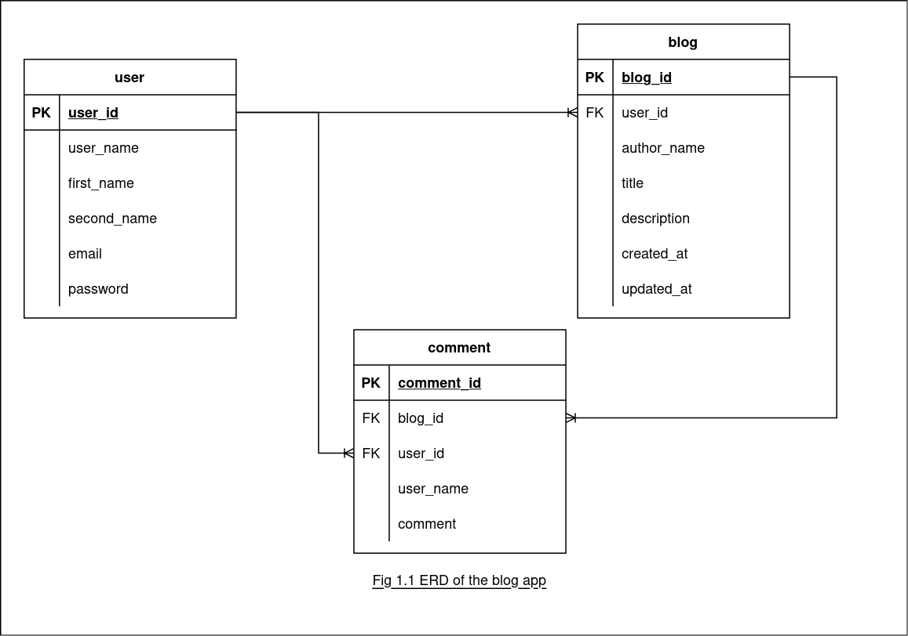

# A blog app rest api made with nestjs

## Operations supported

### For Blogs:

- GET `blogs/`: Returns all array of all blogs
- GET `blogs/<blogId:number>`: Return blog of given `blogId`
- POST `blogs/`: Posts a new blog
  - JSON BODY to pass
  ```json
  {
    "userId": "<string>",
    "author": "<string>",
    "title": "<string>",
    "description": "<string>"
  }
  ```
- PATCH `blogs/<blogId:number>`: Updates the existing blog of given `blogId`
  - JSON BODY to pass
  ```json
  {
    "title": "<string>",
    "description": "<string>"
  }
  ```
- DELETE `blogs/<blogId:number>`: Deletes the post of given `blogId`
- GET `blogs/user/<userId:number>`: Gives all the blogs posted by the given `userID`
- GET `blogs/<blogId:number>/user`: Gives the user who posted the blog given by `blogId`

### For Comments:

- POST `blogs/<blogId>/comment`: Posts comment to the blog given by `blogId`
  - JSON BODY to pass
  ```json
  {
    "userName": "<string>",
    "userId": "string>",
    "comment": "<string>"
  }
  ```
- PATCH `blogs/comment/<commentId:number>`: Updates the comment given by `commentId`
  - JSON BODY to pass
  ```json
  {
    "comment": "<string>"
  }
  ```
- DELETE `blogs/comment/<commentId:number>`: Deletes the comment given by `commentId`
- GET `Comment/<commentId:number>/user`: Returns the user who posted the comment given by `commentId`

### For Users Operations

- POST `users/signup`: Creates a new user
  - JSON BODY to pass
  ```json
  {
    "userName": "<string>",
    "firstName": "<string>",
    "secondName": "<string>",
    "email": "<string>",
    "password": "<string>"
  }
  ```
- POST `users/<userId:number>/update`: updates the existing user given by `userId`

  - JSON BODY to pass

  ```json
  {
    "firstName": "<string>",
    "secondName": "<string>",
    "email": "<string>",
    "password": "<string>"
  }
  ```

## Schema



## Self Notes

- `blog` module is responsible for blog related operations
- For database typeorm is used with postgres being setup using docker which specification is provided by `docker-compose.yml`
- use the below command to fire up docker
  ```bash
  docker compose up -d
  ```
- If docker throws an error of _port already being used_ then follow these steps
  1.  List the docker containers currently active
  ```bash
  docker container ls
  ```
  2.  Remove the docker container currently running to free the ports
  ```bash
  docker rm -f <CONTAINER ID>
  ```
- Some important links for reference and tutorials
  - [nestjs docs](https://docs.nestjs.com/)
  - [typeorm docs](https://typeorm.io/)
